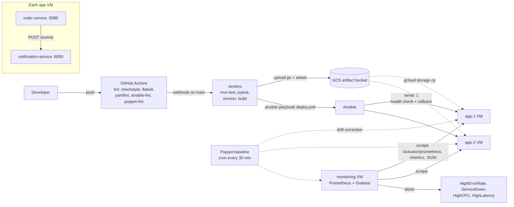

# Order Platform: CI/CD + Observability on GCP

Two microservices (Java order service, Python notification service) with a full delivery
pipeline (GitHub Actions lint, Jenkins build/deploy, Ansible rolling deploy, Puppet drift control)
and a Prometheus/Grafana monitoring stack.

## Architecture



## Layout

| Path | Purpose |
|---|---|
| `services/order-service` | Spring Boot 3 (Java 17). `POST/GET /orders`; Micrometer `orders_created_total`, `order_value`; actuator health + Prometheus |
| `services/notification-service` | FastAPI. `POST /events`, `/health`, `/metrics` (request rate, latency, errors, `notifications_processed_total`) |
| `Jenkinsfile` | Version, parallel build/test, publish to GCS, deploy (main only) |
| `.github/workflows/ci.yml` | Lint jobs and a Jenkins trigger |
| `ansible/` | `provision.yml` (VPC, firewall, VMs), `baseline.yml` (Puppet), `deploy.yml` (rolling), `monitoring.yml` |
| `puppet/modules/baseline` | Packages, admin users, sshd hardening, chrony, node_exporter, 30-minute re-apply cron |
| `monitoring/` | Prometheus config + alert rules, Grafana provisioning + dashboards, local `docker-compose.yml` |
| `scripts/` | `load-generator.sh`, `demo-drift.sh`, `gen_dashboards.py` (regenerates dashboard JSON) |

## Local demo (no cloud needed)

```bash
cd monitoring
docker compose up -d --build
../scripts/load-generator.sh 50          # create orders
```

- Order service: http://localhost:8080/orders , metrics at `/actuator/prometheus`
- Notification service: http://localhost:8000/health , metrics at `/metrics`
- Prometheus: http://localhost:9090 (Status > Targets, Alerts)
- Grafana: http://localhost:3000 (admin / admin) > folder "Order Platform": *Golden Signals* and *Business KPIs*

Stop the stack with `docker compose down`. To demo alerts, `docker compose stop notification-service`
and watch `ServiceDown` go pending, then firing after a minute.

## Cloud setup

1. Create a GCP project, a service account (Compute Admin, Storage Object Admin) and an artifact bucket.
2. Export `GCP_PROJECT`, `GCP_SA_FILE`, `ARTIFACT_BUCKET`, `GRAFANA_ADMIN_PASSWORD`.
3. Provision and configure:
   ```bash
   cd ansible
   ansible-galaxy collection install -r requirements.yml
   ansible-playbook playbooks/provision.yml
   ansible-playbook playbooks/baseline.yml
   ansible-playbook playbooks/monitoring.yml
   ```
4. In GitHub add repository secrets `JENKINS_URL`, `JENKINS_JOB`, `JENKINS_USER`, `JENKINS_TOKEN`. In Jenkins add the
   `gcp-sa-key` secret-file credential and set `ARTIFACT_BUCKET`; the agent needs JDK 17, Maven,
   Python 3, gcloud and Ansible.
5. Push to `main`: GitHub Actions lints, triggers Jenkins, Jenkins builds and publishes, then runs `deploy.yml`.

App VMs need a service account with read access to the artifact bucket, and `admin_source_ranges`
in `roles/gcp_infra/defaults/main.yml` should be narrowed from `0.0.0.0/0`.

## Demo walkthrough

1. **Pipeline:** push a change, watch the GitHub Actions lint jobs pass and Jenkins publish `1.0.<build>`.
2. **Rolling deploy:** `deploy.yml` runs `serial: 1`. Each host gets a new release directory and the
   `current` symlink flips, then the service restarts and the health endpoints are polled
   (`uri` with retries).
3. **Rollback:** push a broken build (for example, a jar that fails to start). The health check
   fails, the `rescue` block re-points `current` at the release recorded in `previous`, restarts, and
   fails the play so the remaining hosts are never touched.
4. **Drift:** `scripts/demo-drift.sh app-1` enables root login and stops chrony, runs the Puppet
   apply (otherwise a 30-minute cron), and shows both reverted.
5. **Observability:** run the load generator; show traffic, error ratio, p95 latency and CPU on
   *Golden Signals*, and orders/min, average order value and revenue on *Business KPIs*.

## What was verified locally, and what was not

Verified:
- `mvn checkstyle:check test` (4 MockMvc tests, in a Maven/JDK 17 container) and `pytest` (4 tests) plus `flake8`.
- `docker compose up`: order creation returns 201, both metric endpoints expose the business
  metrics, all 3 Prometheus targets are UP, the 4 alert rules load (`promtool check rules`), and
  both Grafana dashboards are provisioned.
- `yamllint`, `ansible-playbook --syntax-check` on all four playbooks, `ansible-lint` (production profile),
  `puppet parser validate`, `puppet epp validate` and `puppet-lint`.

Not verified (needs real infrastructure): GCP provisioning, Puppet applied on a real VM, the
Jenkins pipeline and GitHub Actions trigger, the rolling deploy and rollback against live hosts, and the
Grafana panels rendering against live data (the PromQL was only checked via the running local stack's
targets and rules, not by eyeballing each panel). The Jenkinsfile itself was not run (the wheel build was tried
locally and produces the filename the deploy role expects). Treat the playbooks as a reviewed starting point and expect
to adjust them on first real run.

## Possible extensions

Alertmanager with Slack/email routing, Terraform in place of the gcloud modules, blue/green or
canary deploys behind a load balancer, a Puppet server instead of masterless apply, Loki for
logs, and tracing with OpenTelemetry.
